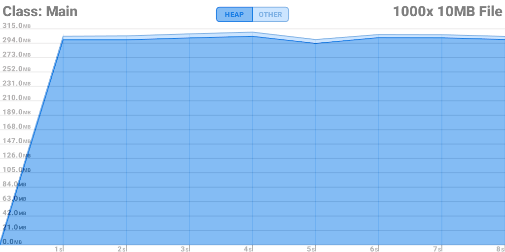
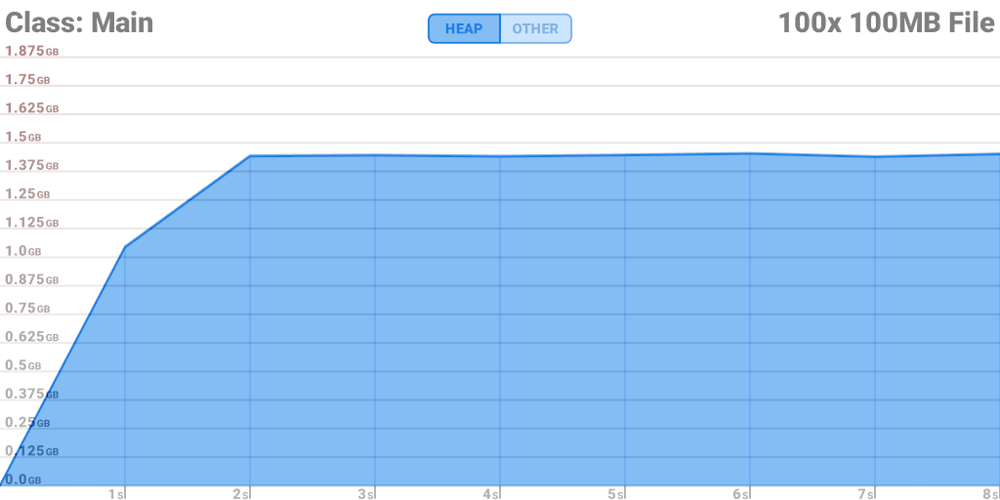
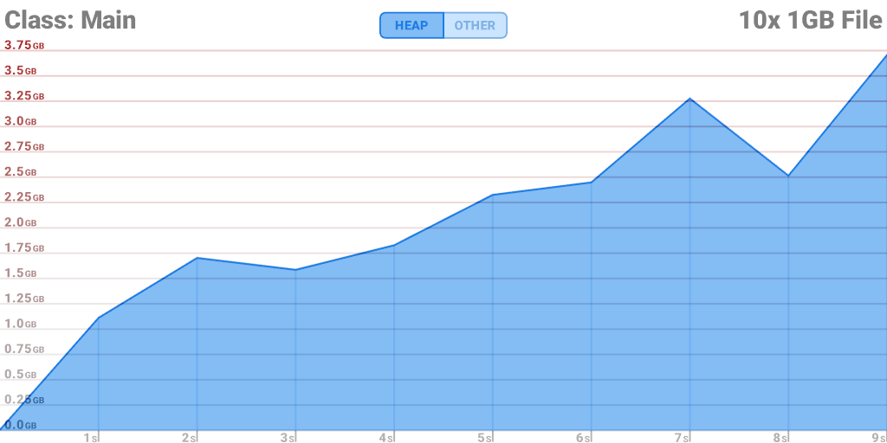
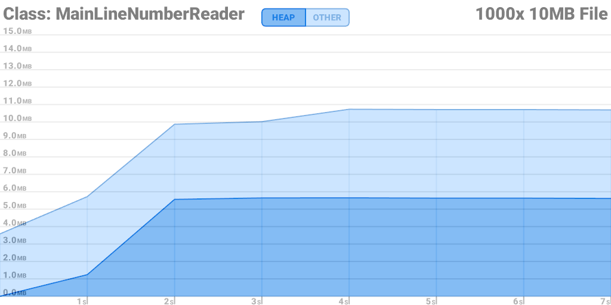
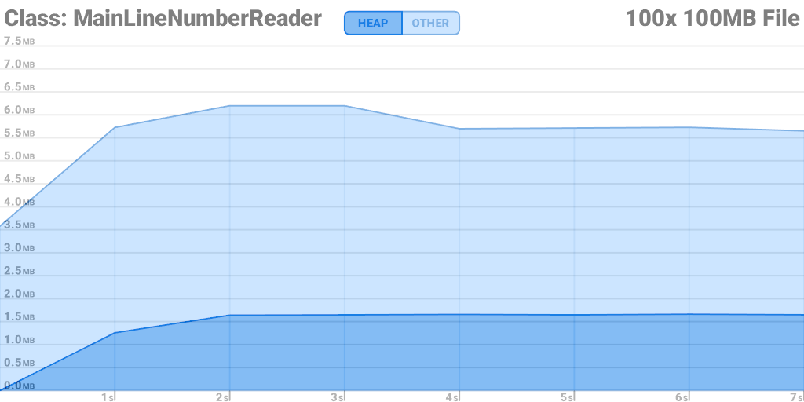
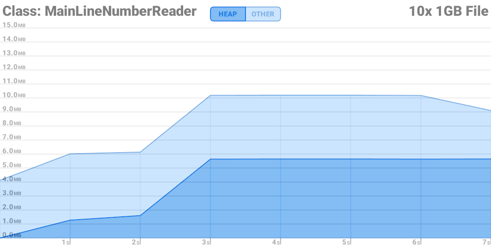
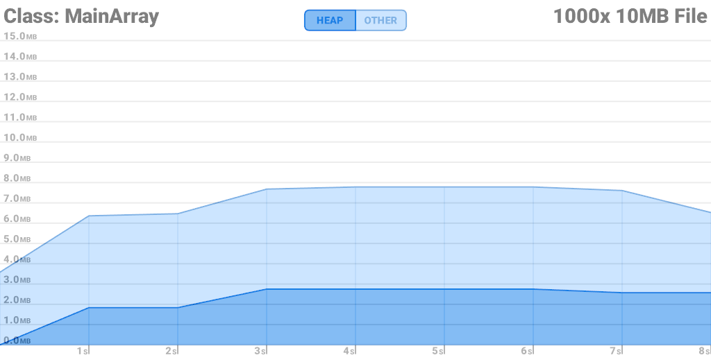
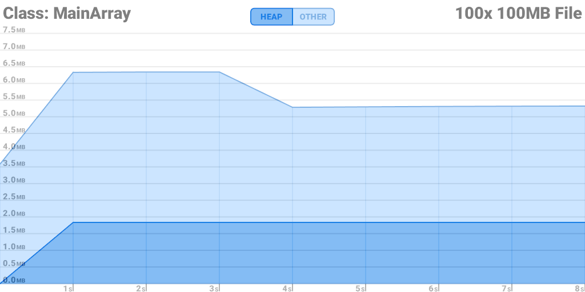
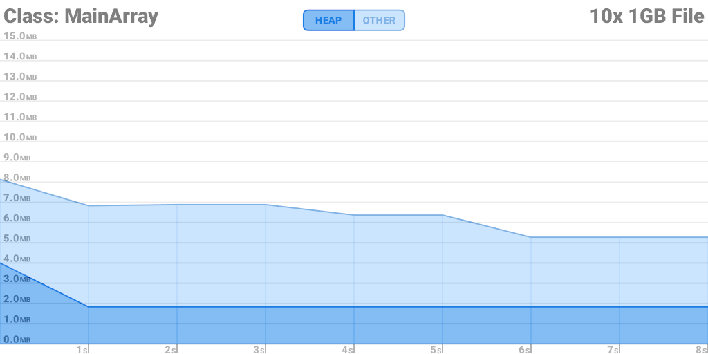
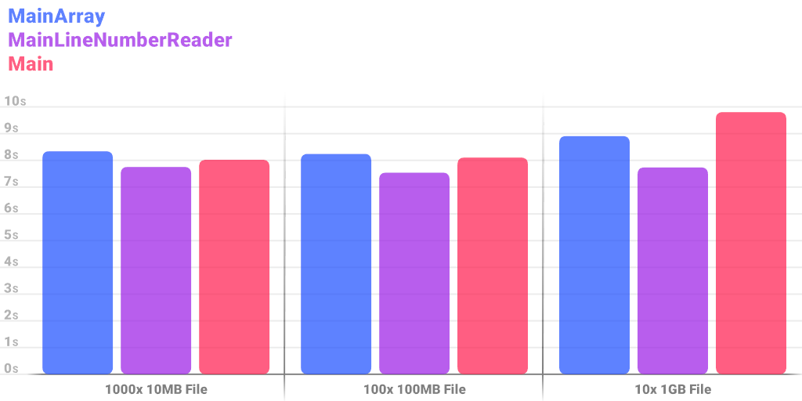

# Assignment Report

## Files added
- CreateTextFile.java: Creates text files of specified size and number with random content.
- MemMonitor.java: Captures memory usage of specified java class with a main-method.
- MainLineNumberReader.java: Variation of the originial Main.java file using a LineNumberReader to count lines.
- MainArray.java: Variation of the originial Main.java file using a basic array to count lines without a buffered reader.

## Performance
All performance samples were captured a PC with an AMD Ryzen 7 7800X3D, 32GB of DDR5 memory, running Windows 11.
All files were read from NVMe storage.

### Main.java:

### MainLineNumberReader.java:

### MainArray.java:

### Runtimes:
